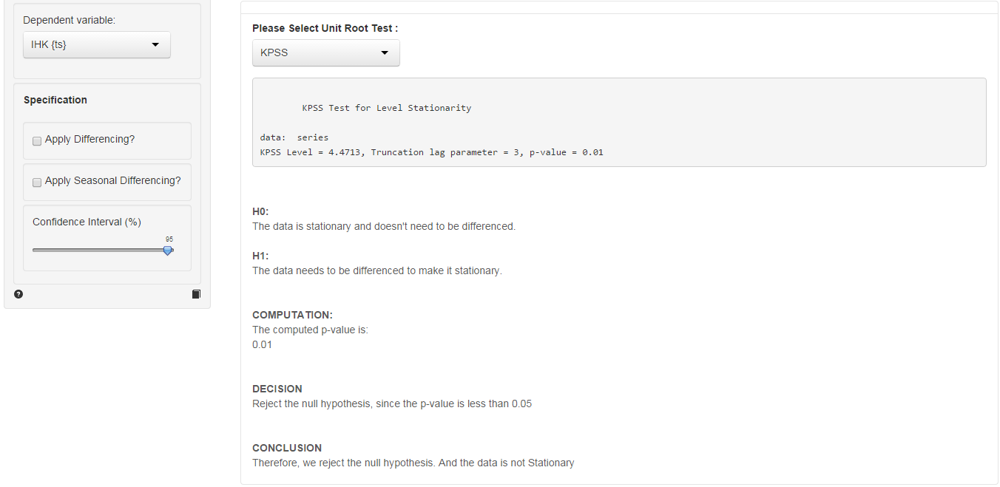
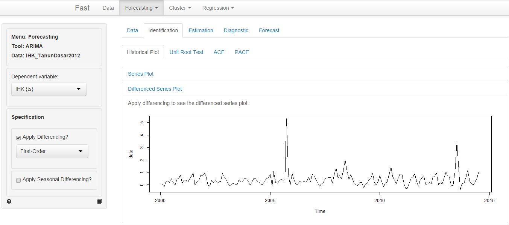
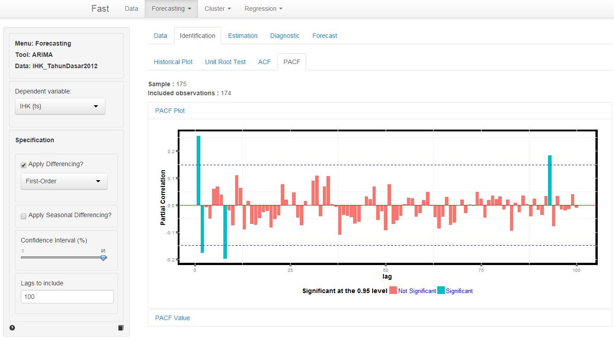

Halaman help ini membantu anda untuk menggunakan Fast statistical software untuk melakukan beberapa analisis ARIMA

Semua file contoh dapat di load melalui Data > Manage. Klik radio buttton 'examples' dan tekan 'Load examples'.

### Contoh 1: Indeks Harga Konsumen
Kita akan melakukan analisis menggunakan data Indeks Harga Konsumen Indonesia yang bersumber dari www.bps.go.id

#### Indeks Harga Konsumen Indonesia 

##### Deskripsi : 

<b> Indeks Harga konsumen (IHK): </b> 
Ialah suatu indeks, yang menghitung rata-rata perubahan harga dalam suatu periode, dari suatu kumpulan barang dan jasa yang dikonsumsi oleh penduduk/rumah tangga dalam kurun waktu tertentu. 

##### Variabel : 

- IHK  = Indeks Harga Konsumen Indonesia bulan Januari 2000 s/d Juli 2014

##### Catatan : 

- Tahun dasar yang digunakan adalah tahun dasar 2012, IHK dihitung berdasarkan pola konsumsi hasil SBH di 82 kota tahun 2012 (2012 = 100)

#### Stasioneritas dan Differencing
Identifikasi model ARIMA dari data IHK akan dapat dilakukan jika data telah menunjukkan pola yang stasioner. 
Tahap awal dari identifikasi ini dilakukan melalui time series plot seperti pada grafik dibawah.

 
Gambar 1. Series plot data IHK

Berdasarkan time series plot tersebut dilihat bahwa data IHK belum menunjukkan pola yang stasioner dalam hal rata-rata. 
Untuk mendukung deteksi grafik, kita dapat melakukan uji unit root dengan pada tab Identification > Unit Root Test. 
Di halaman ini tersedia tiga jenis uji Unit Root test, yaitu Uji ADF (Augmented Dickey-Fuller), KPSS (Kwiatkowski–Phillips–Schmidt–Shin), dan PP (Phillips–Perron)

Hipotesis nol dan hipotesis alternatif dari uji ADF dan PP adalah sebagai berikut:

- H0:Data tidak stasioner (mengandung unit root).
- H1:Data stasioner (tidak mengandung unit root.

sedangkan untuk uji KPSS hipotesisnya berkebalikan dari kedua uji diatas, yaitu: 

- H0:Data stasioner (tidak mengandung unit root.
- H1:Data tidak stasioner (mengandung unit root).

tampilan dari tab Identification > Unit Root Test untuk data IHK adalah sebagai berikut:

 
Gambar 2. Uji unit root data IHK

Untuk itu perlu dilakukan proses differencing agar data menjadi stasioner dalam rata-rata, pertama kali dilakukan proses differencing orde pertama lalu dilakukan analisis ulang pada data.
Differencing dilakukan dengan menceklis tombol 'Apply Differencing?', dan memilih untuk differencing orde pertama atau orde kedua

Gambar dibawah menunjukkan time series plot data IHK setelah dilakukan differencing orde pertama. Terlihat bahwa data tidak menunjukkan pola tren lagi namun hal ini perlu didukung dengan melakukan uji unit root lagi. 

 
Gambar 3. Series plot data IHK difference orde pertama

Terlihat bahwa data tidak menunjukkan pola tren lagi namun hal ini perlu didukung dengan melakukan uji unit root lagi.
Hasil uji unit root setelah proses differencing orde pertama adalah sebagai berikut:

 
Gambar 4. Uji unit root data IHK difference orde pertama

Hasil uji unit root pada gambar diatas menunjukkan bahwa data telah stasioner maka identifikasi model sudah dapat dilakukan.

#### Identifikasi model
Tahap selanjutnya adalah mengidentifikasi model ARIMA untuk data IHK. Identifikasi model dilakukan dengan melihat pola dari plot ACF dan PACF
Untuk melihat plot ACF tekan tab Identification > ACF. berikut tampilan plot ACF untuk data IHK setelah data IHK differencing orde pertama:

Gambar 5. Plot ACF data IHK difference orde pertama

pengguna dapat mengganti jumlah lag yang ditampilkan dengan mengubah nilai pada kota 'Lags to include'.pada gambar diatas ditampilkan plot ACF untuk 100 lag.
sedangkan untuk plot PACF dapat dilihat pada tab Identification > PACF.

Gambar 6. Plot PACF data IHK difference orde pertama

Berdasarkan plot ACF (gambar 5) dan plot PACF (grafik 6) terlihat data menunjukkan pola yang stasioner pada lag non musiman (seirama dengan hasil uji unit root) dan lag musiman juga menunjukkan pola yang turun dengan cepat. Sementara itu, plot ACF pada lag 1 (non musiman) dan lag 12 (musiman) keluar batas dan plot PACF pada lag 1 (non musiman) juga keluar batas. Oleh karena itu, dugaan model ARIMA sementara adalah ARIMA (1,1,1)(0,0,1)12
Selanjutnya hasil identifikasi manual ini dibandingkan dengan hasil identifikasi oleh aplikasi.

#### Estimasi Model
Estimasi model dilakukan pada tab ARIMA > Estimation. pada halaman ini akan ditampilkan detail dari model yang di estimasi
berikut output :

Gambar 7. Output halaman estimasi model ARIMA

Gambar 8. Sidebar estimasi model ARIMA

pada sidebar terdapat beberapa pilihan:
- Pilihan menentukan model secara otomatis atau memasukkan orde dari model secara manual, terdapat pada dropdown list 'Modelling method'
- Pilihan kriteria model terbaik, terdapat pada dropdown list 'Information criteria'
- Pilihan uji unit root untuk mencari orde differencing, terdapat pada dropdown list 'Unit root test'
- Pilihan uji seasonal test untuk mencari orde musiman, terdapat pada dropdowon list 'Seasonal test'
- Pilihan untuk memakai seasonal model atau tidak, pada checkbox 'seasonal model'
- Pilihan untuk memakai algoritma stepwise atau tidak dalam pencarian model, terdapat pada checkbox 'Use stepwise selection'.
  pencarian model tanpa memakai algoritma stepwise akan memakan waktu yang lebih lama, terutama untuk model ARIMA musiman (SARIMA).
- Pilihan untuk memasukkan parameter drift/konstan pada model, terdapat pada checkbox 'Allow drift in models'  

pengguna juga dapat memilih orde dari model secara manual, yaitu dengan memilih pilhan 'Modelling method' manual selection

Gambar 9. Penentuan model ARIMA manual

model yang telah dipilih pengguna dapat ditambahkan sebagai bahan perbandingan untuk memilih model terbaik denga menekan tombol 'Add this model for comparison'.
model yang ditambahkan akan tampil pada tabel yang terletak dibawah. tabel ini berisi model-model yang nantiya dapat akan dipilih menjadi kandidat model terbaik.
tabel berikut menampilkan model pilihan model terbaik untuk data IHK.

Gambar 10. Tabel daftar model terbaik

kemudian pada dropdown list 'best model criteria', pengguna dapat memilih kriteria pemelihan model terbaik berdasarkan apa. 
setelah pengguna sudah menambahkan semua kemungkinaan model terbaik maka selanjutnya adalah melakukan uji diagnostik

#### Uji diagnostik 
Uji diagnostik terdapat pada tab ARIMA > Diagnostic, pada halaman ini akan ditampilkan dua uji untuk menentukan apakah model terbaik sudah memenuhi asumsi.
berikut outputnya untuk data IHK.

Gambar 11. Output halaman uji diagnostik

pada halaman ini terdapat pilihan untuk melakukan uji Ljung-Box atau Box-Pierce terhadap residual dari model.
dalam hal ini untuk data IHK model terbaik adalah ARIMA(0,1,1)(1,0,0)[12] with drift. Pada halaman ini aplikasi akan menampilkan kesimpulan apakah data telah white noise atau tidak secara otomatis.
terlihat bahwa model terbaik telah memenuhi asumsi white noise.

#### Peramalan 
Pilih tab ARIMA > Forecast.
Setelah model terbaik lolos uji diagnostik, maka tahap selanjutnya adalah melakukan peramalan. 
tampilan peramalan untuk 6 bulan kedepan dari model ARIMA(0,1,1)(1,0,0)[12] adalah sebagai berikut:

Gambar 12. Output peramalan IHK 6 bulan kedepan

Gambar 12. Fittted plot 
 

Gambar 13. Output Out-of sample forecast

Itulah langkah-langkah penggunaan aplikasi ini untuk meramal beserta praktekny pada data IHK semoga bermanfaat
 &copy; Debi Tomika (2014) 
