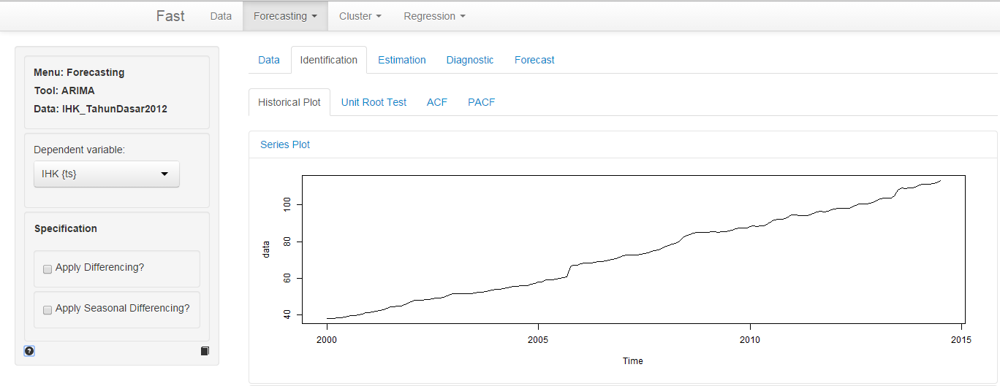
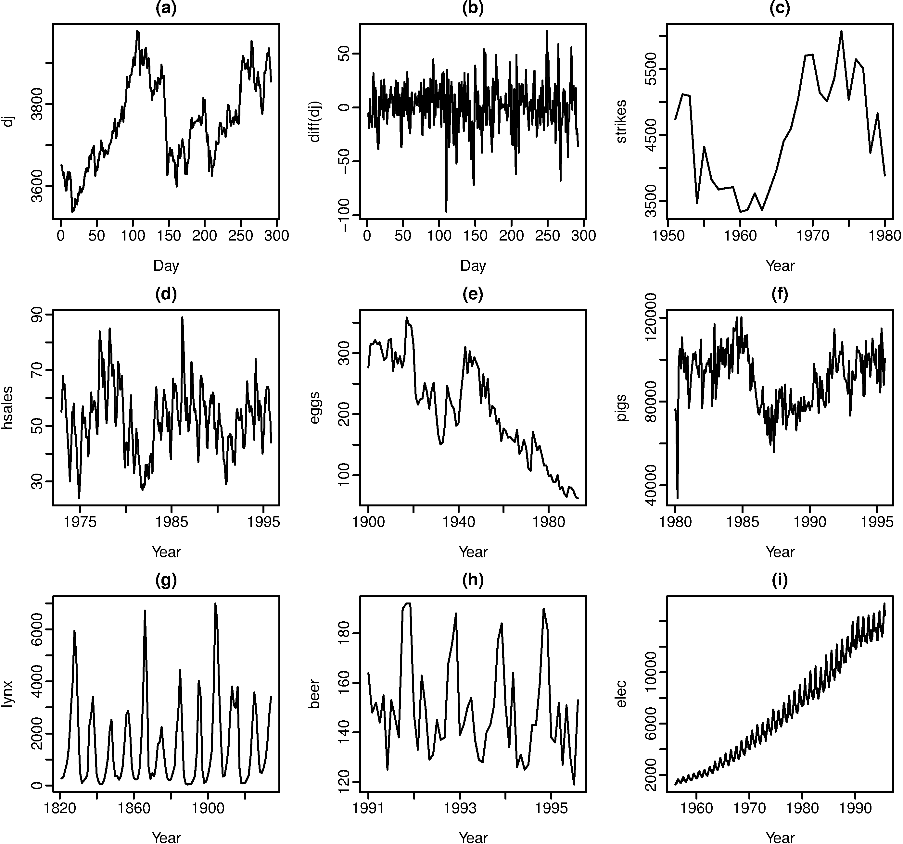
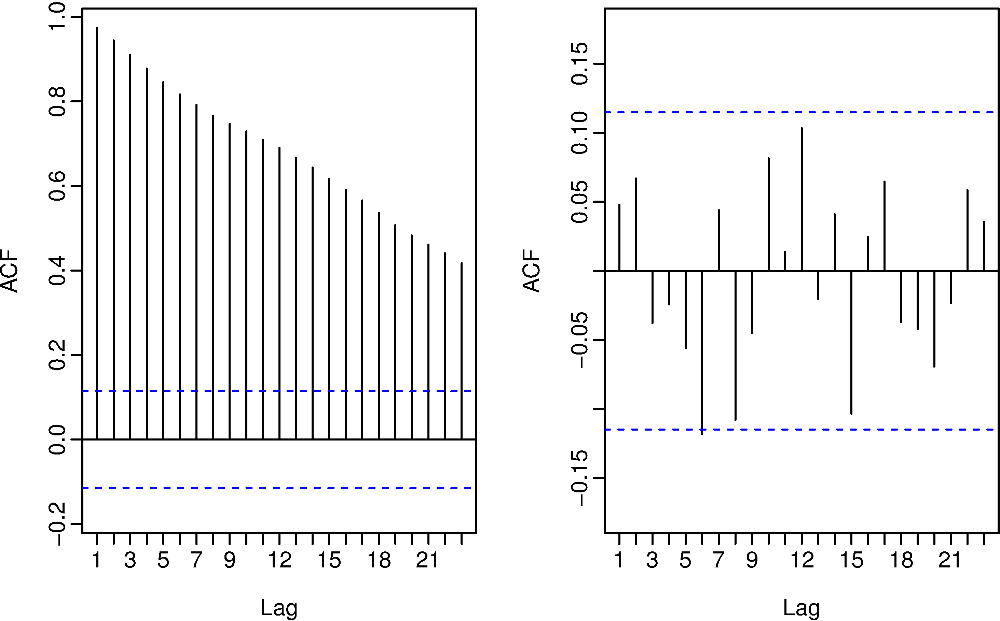
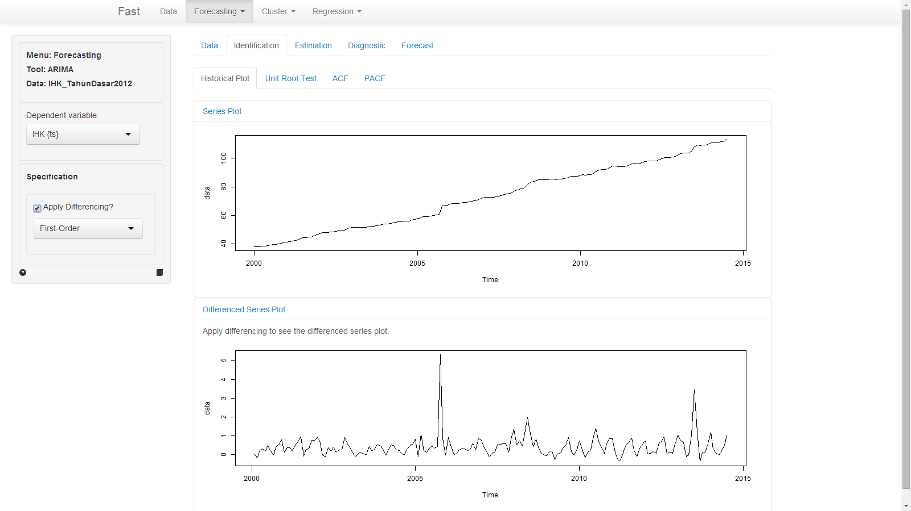
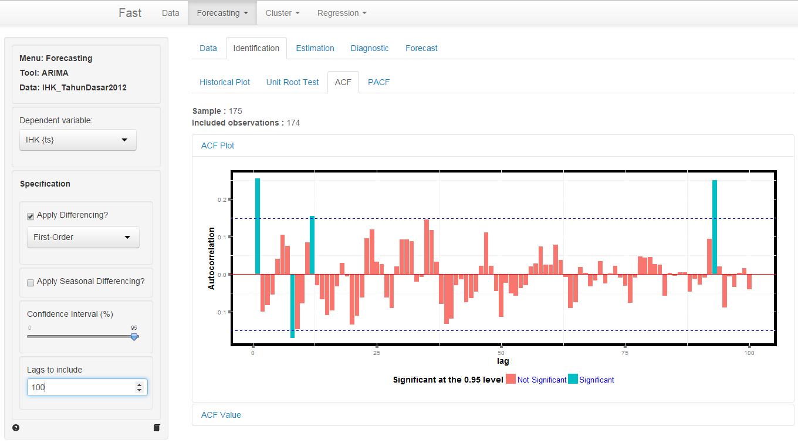
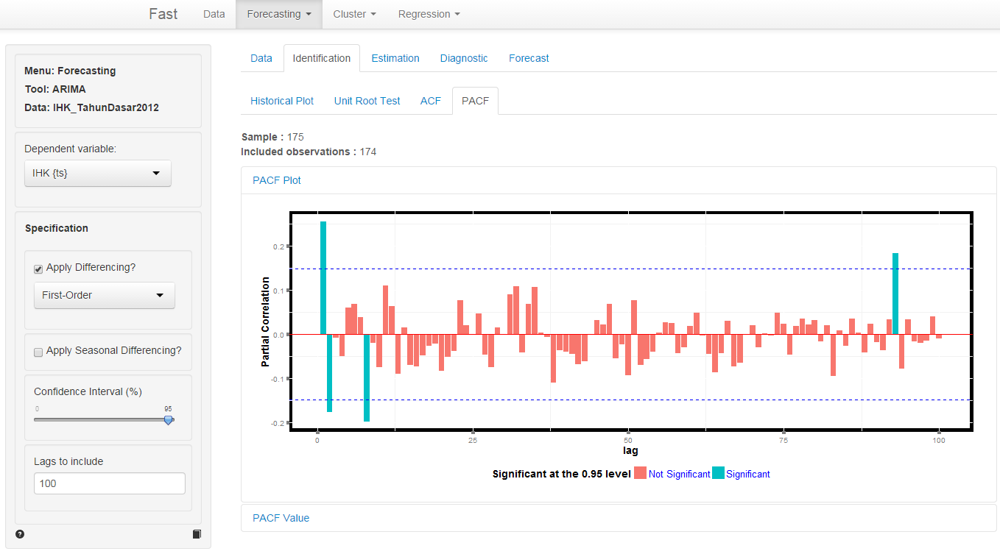
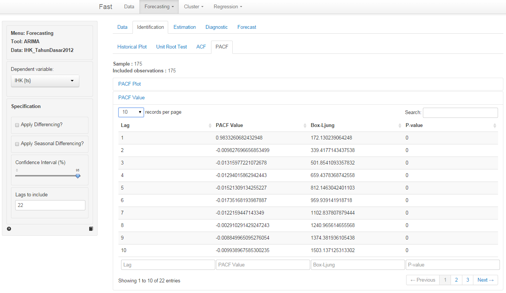

This help tells you how to use the Fast statistical software to carry out some ARIMA analyses 

All example files can be loaded from Data > Manage. Click the 'examples' radio button and press 'Load examples'.

### Example 1: Indeks Harga Konsumen
We have access to data from www.bps.go.id 

#### Indeks Harga Konsumen Indonesia 

##### Description : 

<b> Indeks Harga konsumen (IHK): </b> 
Ialah suatu indeks, yang menghitung rata-rata perubahan harga dalam suatu periode, dari suatu kumpulan barang dan jasa yang dikonsumsi oleh penduduk/rumah tangga dalam kurun waktu tertentu. 

##### Variables : 

- IHK  = Indeks Harga Konsumen Indonesia bulan Januari 2000 s/d Juli 2014

##### Notes : 

- Tahun dasar yang digunakan adalah tahun dasar 2012, IHK dihitung berdasarkan pola konsumsi hasil SBH di 82 kota tahun 2012 (2012 = 100)

#### Time plots

For time series data, the obvious graph to start with is a time plot. That is, the observations are plotted against the time of observation, with consecutive observations joined by straight lines.

Output from FAST (Forecast > ARIMA) is provided below:

#### Stationarity and differencing

A stationary time series is one whose properties do not depend on the time at which the series is observed. So time series with trends, or with seasonality, are not stationary — the trend and seasonality will affect the value of the time series at different times. On the other hand, a white noise series is stationary — it does not matter when you observe it, it should look much the same at any period of time.

Some cases can be confusing — a time series with cyclic behaviour (but not trend or seasonality) is stationary. That is because the cycles are not of fixed length, so before we observe the series we cannot be sure where the peaks and troughs of the cycles will be.

In general, a stationary time series will have no predictable patterns in the long-term. Time plots will show the series to be roughly horizontal (although some cyclic behaviour is possible) with constant variance.

 Figure 1.2: Which of these series are stationary? (a) Dow Jones index on 292 consecutive days; (b) Daily change in Dow Jones index on 292 consecutive days; (c) Annual number of strikes in the US; (d) Monthly sales of new one-family houses sold in the US; (e) Price of a dozen eggs in the US (constant dollars); (f) Monthly total of pigs slaughtered in Victoria, Australia; (g) Annual total of lynx trapped in the McKenzie River district of north-west Canada; (h) Monthly Australian beer production; (i) Monthly Australian electricity production.

Consider the nine series plotted in Figure 1.2. Which of these do you think are stationary? Obvious seasonality rules out series (d), (h) and (i). Trend rules out series (a), (c), (e), (f) and (i). Increasing variance also rules out (f). That leaves only (b) and (g) as stationary series. At first glance, the strong cycles in series (g) might appear to make it non-stationary. But these cycles are aperiodic — they are caused when the lynx population becomes too large for the available feed, so they stop breeding and the population falls to very low numbers, then the regeneration of their food sources allows the population to grow again, and so on. In the long-term, the timing of these cycles is not predictable. Hence the series is stationary.

##### Differencing

In Figure 1.2, notice how the Dow Jones index data was non-stationary in panel (a), but the daily changes were stationary in panel (b). This shows one way to make a time series stationary — compute the differences between consecutive observations. This is known as differencing.

Transformations such as logarithms can help to stabilize the variance of a time series. Differencing can help stabilize the mean of a time series by removing changes in the level of a time series, and so eliminating trend and seasonality.

As well as looking at the time plot of the data, the ACF plot is also useful for identifying non-stationary time series. For a stationary time series, the ACF will drop to zero relatively quickly, while the ACF of non-stationary data decreases slowly. Also, for non-stationary data, the value of r1 is often large and positive

Figure 1.3: The ACF of the Dow-Jones index (left) and of the daily changes in the Dow-Jones index (right).

to do differencing check the 'Apply Differencing' checkbox and choose the 'First-Order' or 'Second-Order' differencing 

Output from FAST (Forecast > ARIMA) is provided below:

#### Correlogram
the correlogram provided in ACF and PACF tab

Output is provided below:

the output above show the following :
- The ACF and PACF plot 
- The blue dashed line show confidence interval for barlet test
- Autocorrelation value at each lag
- Box-Ljung test value at each lag 

