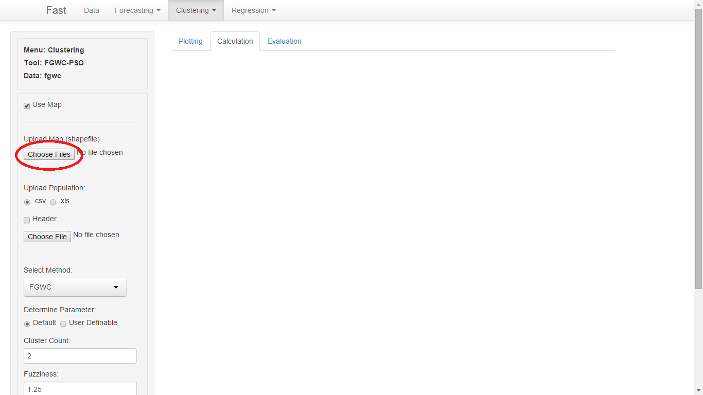

Halaman ini memfasilitasi <i>user</i> untuk meng<i>cluster</i>kan data ke dalam peta. Algoritma <i>Fuzzy Geographically Weighted Clustering- Particle Swarm Optimization</i> membutuhkan data <b>populasi</b> dan <b>jarak antar wilayah</b> dari data yang akan di<i>cluster</i>

  
<b>LANGKAH-LANGKAH <i>CLUSTERING</i> DATA :</b>

<b>1. </b>Pilih menu <i>Cluster Your Data</i>
 

<b>2. </b>Jika <i>user</i> menggunakan <b>Use Map</b>, maka <i>user</i> harus menyediakan sebuah peta. Kemudian pilih <i>Choose File</i>
 

   

<i>User</i> harus memilih sejumlah file berekstensi .shp, .dbf, .gml, .shx, .xsd, dll

   

<b>3. </b>Masukkan data populasi. Data jarak tidak diperlukan, disebabkan jarak diambil dari pusat <i>polygon</i> shapefile yang telah di<i>upload</i>. Namun, user perlu mengupload data jarak jika user tidak mengupload shapefile

<b>4. </b>Pilih metode yang akan digunakan : FGWC atau FGWC-PSO

   

<b>5. </b>Pilihan <i>user definable</i> digunakan apabila <i>user</i> ingin mengganti nilai default parameter dari metode yang digunakan 

<b>6. </b>Masukkan nilai <i>fuzzifier</i> dan jumlah <i>cluster</i>

   

<b>7. </b>User dapat menyimpan hasil perhitungan menggunakan fungsi <b>download</b>

   

Pengaturan nilai parameter default adalah sebagai berikut

<b>FGWC</b>

Parameter&nbsp&nbsp-&nbsp&nbspValue

Alfa&nbsp&nbsp0.5

Beta&nbsp&nbsp0.5

a&nbsp&nbsp1

b&nbsp&nbsp1

e&nbsp&nbsp0.0001

 
<b>PSO</b>

Parameter&nbsp&nbsp-&nbsp&nbspValue

c1&nbsp&nbsp2

c2&nbsp&nbsp2

Maks.Iter&nbsp&nbsp100

e&nbsp&nbsp0.0001

 
<b>HASIL CLUSTERING DATA</b>

Hasil akan divisualisasikan dalam bentuk peta, jumlah cluster sesuai dengan input dari user. Jika user memberikan nilai c = 2, maka akan dihasilkan dua warna. Warna pertama menunjukkan cluster ke-1, sedangkan warna kedua menunjukkan cluster ke-2

 

   

Pada tabel akan ditampilkan sejumlah data, antara lain

   

<b>1. </b>ID menunjukkan nomor daerah pada map

<b>2. </b>Proportion menunjukkan proporsi keanggotaan suatu daerah terhadap suatu cluster. Semakin besar nilai proporsi, maka semakin besar kecenderungan suatu daerah menjadi anggota cluster tertentu

<b>3. </b>Angka cluster menunjukkan suatu daerah menjadi anggota cluster tertentu 

<b>4. </b>Data yang lain merupakan informasi yang terkandung dalam shapefile yang telah diupload oleh user

