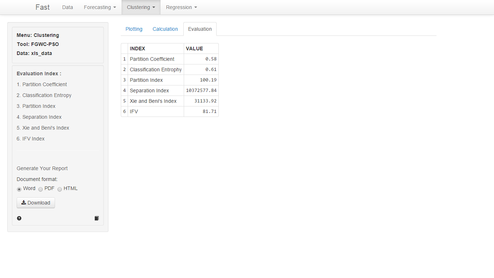

<ol>
	<li><b>Partition Coefficient (PC)</b></li>
	
Indeks PC mengukur jumlah tumpang tindih antar <i>cluster</i>. Jika nilai indeks semakin besar maka semakin bagus.

	
<i>Greater is better</i>

	 
	<li><b>Classification Entropy (CE)</b></li>
	
Indeks CE mengukur tingkat kekaburan (<i>fuzzyness</i>) dari sebuah partisi matrika. Jika nilai indeks semakin kecil maka semakin bagus.

	
<i>Smaller is better</i>

	 
	<li><b>Partition Index (PI)</b></li>
	
Indeks PI adalah rasio dari jumlah kekompakan dan pemisahan dari <i>cluster</i>. Jika nilai indeks semakin kecil maka semakin bagus.

	
<i>Smaller is better</i>

	 
	<li><b>Separation Index (S)</b></li>
	
Indeks S menggunakan pemisahan jarak minimum untuk validitas sebuah partisi. Sejumlah cluster yang optimal diketahui jika nilai indeks S tersebut minimal.

	
<i>Smaller is better</i>

	 
	<li><b>Xie and Beni's Index (XB)</b></li>
	
Indeks XB bertujuan untuk mengkuantifikasikan rasio dari total varian dalam <i>cluster</i> dan pemisahan sebuah <i>cluster</i>. Sejumlah <i>cluster</i> yang optimal diketahui jika nilai indeks XB tersebut minimal.

	
<i>Smaller is better</i>

	 
	<li><b>IFV Index</b></li>
	
IFV seringkali digunakan untuk menvalidasi fungsi sebuah fuzzy clustering untuk data spasial, dikarenakan IFV kuat dan stabil. Ketika IFV maksimum, maka akan menghasilkan nilai yang paling optimal dari sebuah kumpulan data

	
<i>Greater is better</i>

	 
</ol>

