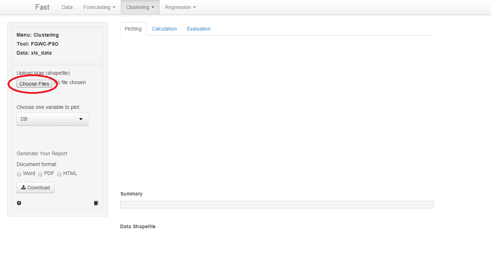
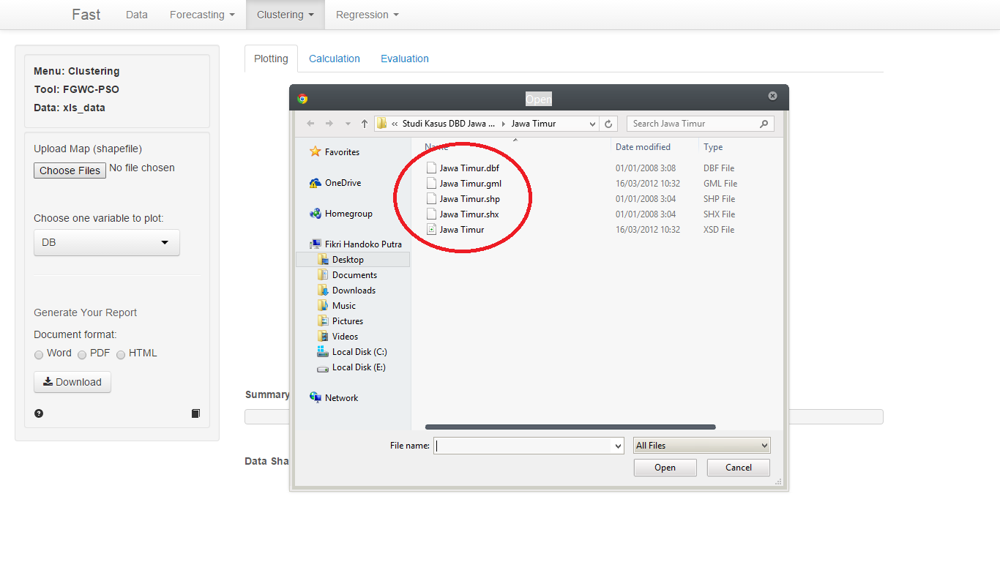
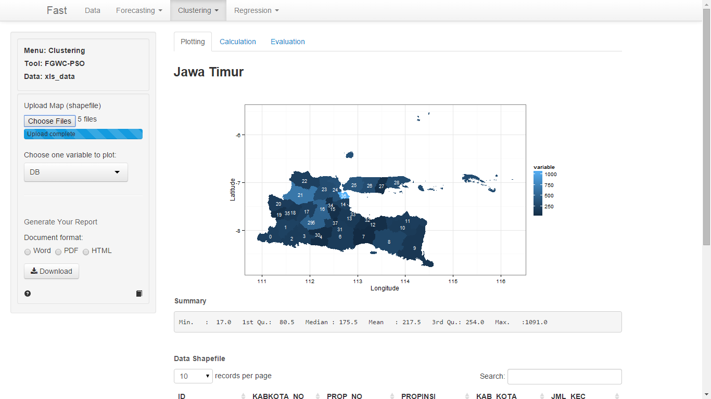
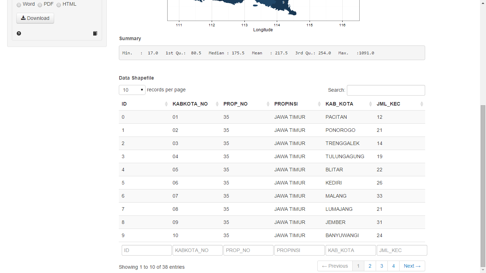

<b>LANGKAH-LANGKAH MEMVISUALISASIKAN DATA :</b>
 

<b>1. </b>Pilih menu <i>Upload Your Map</i> untuk mengunggah <i>shapefile</i>

<b>2. </b>Klik tombol <i>Pilih File</i> pada menu <b>Upload Map</b>. Peta yang dipilih oleh user harus sesuai dengan data yang telah diupload (Misal jumlah kabupaten peta harus sama dengan jumlah kabupaten dalam data). 

Gambar 1. Upload Map

 

Peta yang akan di<i>upload</i> harus berekstensi .shp, .dbf, .gml, .shx, .xsd. Peta tidak akan muncul jika <i>user</i> hanya meng<i>upload</i> file yang berekstensi .shp saja.

Gambar 2. Select Map

  

<b>3. </b>Pilih variabel yang akan divisualisasikan ke dalam peta. Peta akan menvisualisasikan data sesuai dengan keadaan data.

Gambar 3. View Map

  

<b>3. </b>Simpan hasil visualisasi dalam tipe pdf, word, maupun html dengan memilih tombol <b>download</b>.

    
<b>HASIL VISUALISASI DATA :</b>

<b>1. </b>Di bagian <i>main panel</i> akan ditampilkan nama dan peta dari daerah yang telah user upload.

<b>2. </b>Di bagian <b>summary</b> akan ditampilkan hasil summary statistik berupa nilai minimum, nilai maksimum, kuartil pertama, kuartil kedua, kuartil ketiga, dll

Gambar 4. Summary dan Data Shapefile

  

<b>3. </b>Di bagian <b>Data Shapefile</b> akan ditampilkan informasi yang dimiliki peta (shapefile)
