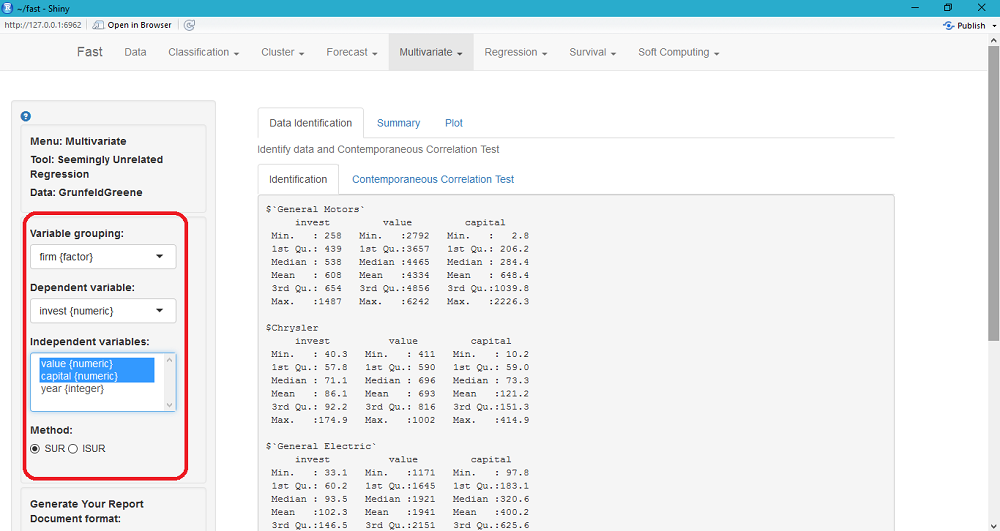

Halaman "Help" ini dapat digunakan untuk menjelaskan prosedur analisis regresi dengan menggunakan Seemingly Unrelated Regression (SUR)

### Seemingly Unrelated Regression (SUR)
Sebagai contoh awal, anda dapat menggunakan data "GrunfeldGreene". Data ini dapat anda load melalui menu Data, langkahnya sebagai berikut: 
1. Pilih menu "Data". 
2. Pilih "Example" pada menu "Load data" yang ada di sidebar(sisi kiri) halaman. 
3. Tekan tombol "Load Example". 
4. Pilih data "GrunfeldGreen" pada menu "Datasets". 

### Contoh: Analisis SUR dengan data GrunfeldGreen
Data GrunfeldGreen digunakan oleh Zellner (1962) dalam melakukan analisis Seemingly Unrelated Regression (SUR). Data ini merupakan data nilai investasi dari 5 perusahaan pada tahun 1935-1954. 
Variabel-variabel pada data Grunfeld Greene: 
1. Invest 
2. value 
3. Capital 
4. Firm 
5. Year 
Untuk melihat struktur data dilihat pada menu "View" yang tersedia pada halaman menu "Data". 

### Step 1
Mengatur parameter (pada sidebar halaman) yang akan digunakan untuk proses analisis. 
1. Menentukan "Variable Grouping". (Variabel yang akan digunakan sebagai dasar pembagian data) 
2. Menentukan "Dependent Variable". 
3. Menentukan "Independent Variables". (Minimal 2) 
4. Menentukan "Method". (Metode analisis) 
 
Gambar 1. Pengaturan parameter 

### Step 2
Identifikasi data untuk melihat struktur data dan adanya korelasi kesebayangan pada data. Langkah-langkah: 
1. Pilih tab menu "Data Identification". 
2. Pilih sub tab menu "Identification". 
 
Gambar 2. Hasil Identifikasi Struktur Data 
3. Pilih sub tab menu "Comtemporaneous Correlation Test". 
 
Gambar 3. Hasil Uji Korelasi Kesebayangan 

### Step 3
Estimasi model persamaan. Langkah-langkah: 
1. Pilih tab menu "SUmmary". 
2. Pilih sub tab menu "Covariance Matrix". 
 
Gambar 4. Covariance Matrix Residuals 
3. Pilih sub tab menu "Model Estimation". 
 
Gambar 5. Hasil Estimasil Model 

### Step 4
Uji kenormalan residual dari model yang diestimasi dengan Q-Q plot. Langkah-langkah: 
1. Pilih tab menu "Plot". 
 
Gambar 6. Hasil Q-Q Plot 

Demikian langkah-langkah dalam melakukan analisis SUR pada aplikasi ini. Semoga bermanfaat. 

&copy; Rifana Yuniar Rahman (2016)
